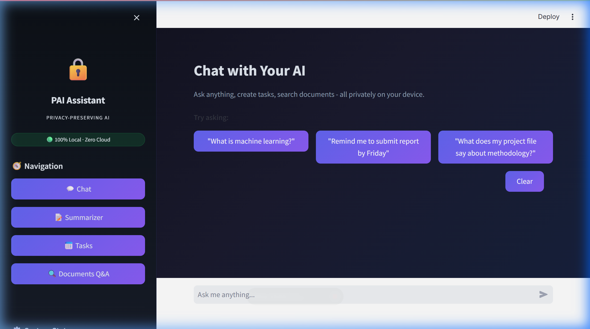
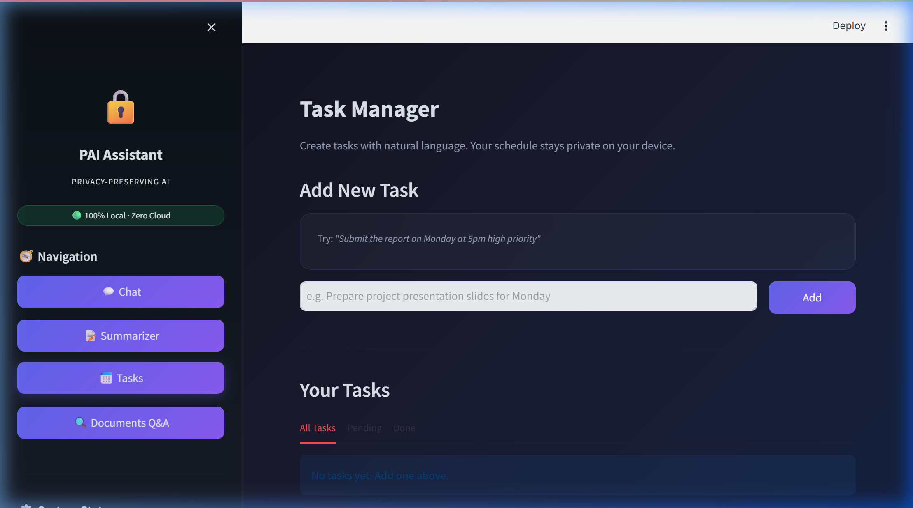
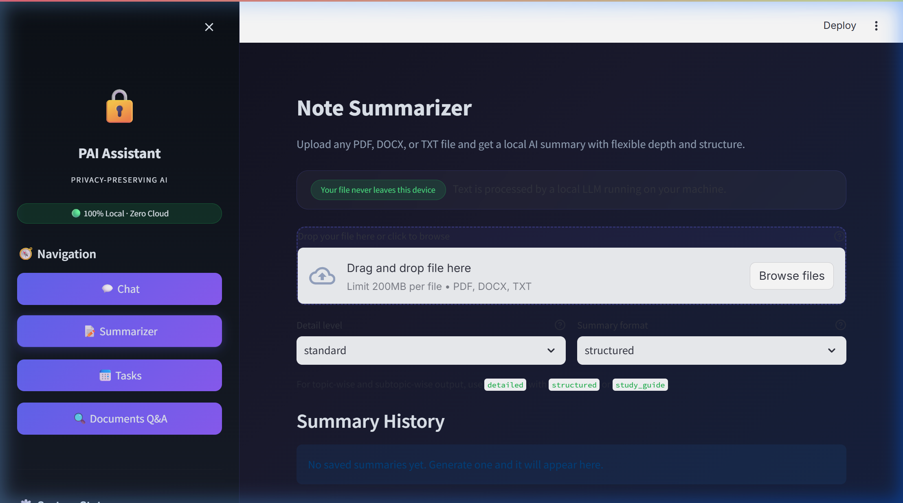
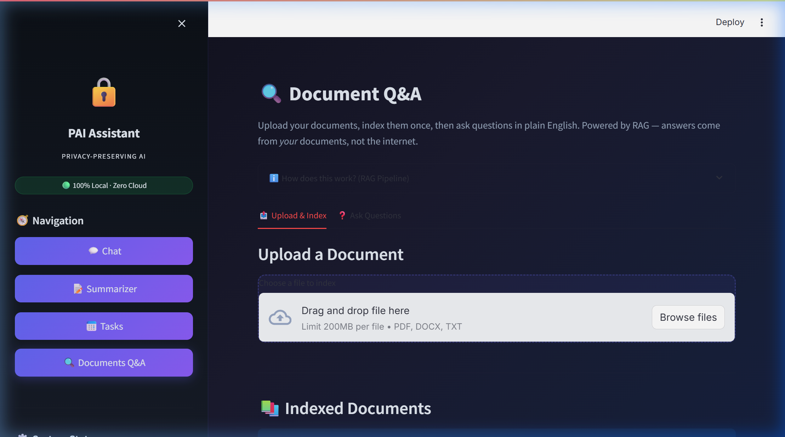

# PrivAI — Privacy-First Personal AI Assistant

<div align="center">

**A fully local, multi-agent AI assistant. No cloud. No API keys. Zero data leakage.**

[](https://www.python.org/)
[](https://fastapi.tiangolo.com/)
[](https://streamlit.io/)
[](https://ollama.com/)
[](docs/privacy_design.md)

</div>

---

## ✨ What is PrivAI?

**PrivAI** is a privacy-preserving AI assistant that runs **entirely on your machine**. It combines a multi-agent backend with a polished Streamlit UI — featuring chat, document Q&A, intelligent summarization, and natural language task management — all powered by local LLMs via [Ollama](https://ollama.com/).

> 🔒 **Your data never leaves your device.** No cloud API keys. No telemetry. No data leakage.

---

## 🖥️ UI Screenshots

<table>
<tr>
<td align="center"><br><em>🗨️ Multi-agent chat with intent display</em></td>
<td align="center"><br><em>✅ Natural language task manager</em></td>
</tr>
<tr>
<td align="center"><br><em>📄 Configurable document summarizer</em></td>
<td align="center"><br><em>🔍 RAG-powered document Q&A</em></td>
</tr>
</table>

---

## 🚀 Features

### 🤖 Multi-Agent Chat Routing
Messages are classified by intent and routed to specialist agents. Every response shows:
- 🎯 **Detected intent** — what the system thinks you want
- 🤝 **Agent handoff trace** — which agents were invoked
- 📍 **Handling agent** — who answered

### 📄 Document Summarization
Upload PDFs, DOCX, or TXT files and get structured summaries:
- **Detail levels:** `concise` · `standard` · `detailed`
- **Output formats:** `plain` · `structured` · `study_guide`

### ✅ Natural Language Task Management
Create tasks from plain English — no forms needed:
- *"Remind me to submit the project report by Friday at 5pm"*
- Deterministic weekday parsing, priority and status updates from the UI

### 🔍 Document Q&A (RAG)
Ask questions about your uploaded documents using a full RAG pipeline:
- **Embed → Retrieve → Rerank → Generate**
- Powered by ChromaDB + SentenceTransformers + Phi-3 Mini
- Cross-encoder reranking for high-precision answers

### 🛡️ Privacy by Design
- All services bound to `127.0.0.1` (loopback only)
- ChromaDB telemetry explicitly disabled
- Optional AES-256 file encryption
- Optional Differential Privacy noise on embeddings (ε=1.0)
- [Full privacy design →](docs/privacy_design.md)

---

## 🏗️ Architecture

```
┌──────────────────────────────────────────┐
│          PRESENTATION LAYER              │
│   Streamlit UI — localhost:8501          │
│   Chat  │  Summarizer  │  Tasks  │  RAG  │
└──────────────┬───────────────────────────┘
               │ HTTP (loopback only)
┌──────────────▼───────────────────────────┐
│          APPLICATION LAYER               │
│   FastAPI REST API — localhost:8000      │
│   /chat  /summarize  /tasks  /documents  │
└───┬──────┬─────┬──────┬──────────────────┘
    │      │     │      │
    ▼      ▼     ▼      ▼
 Agents   RAG  Tasks  Memory
  Layer   Eng   Mgr    Layer
    │      │            │
    ▼      ▼            ▼
 Ollama ChromaDB     SQLite
 :11434  (local)    (local)
```

**Agent Pipeline:**
```
User Input
    │
    ▼
Intent Detector (TinyLlama)
    │
    ├── summarize       → Summarizer Agent
    ├── schedule        → Scheduler Agent
    ├── query_document  → Document QA Agent
    ├── list_tasks      → Task Manager Agent
    ├── delete_task     → Task Manager Agent
    └── general_chat    → General Chat Agent
```

---

## 📁 Project Structure

```
PrivAI/
├── 📂 app/                     # FastAPI backend
│   ├── agents/                 # Multi-agent system
│   │   ├── intent_detector.py  # TinyLlama intent classifier
│   │   ├── task_planner.py     # Orchestrator / coordinator
│   │   ├── general_chat_agent.py
│   │   ├── scheduler_agent.py
│   │   ├── task_manager_agent.py
│   │   ├── document_qa_agent.py
│   │   └── summarizer_agent.py
│   ├── models/
│   │   ├── llm_client.py       # Ollama wrapper (Phi-3, TinyLlama)
│   │   └── embedder.py         # SentenceTransformers embeddings
│   ├── memory/
│   │   ├── conversation.py     # SQLite chat history
│   │   └── vector_store.py     # ChromaDB interface
│   ├── tools/
│   │   ├── rag_engine.py       # Embed → Retrieve → Rerank → Generate
│   │   ├── scheduler.py        # NLP → task → SQLite
│   │   └── summarizer.py       # Chunk → summarize → merge
│   ├── storage/                # Database + file manager
│   ├── config.py               # All configuration constants
│   └── main.py                 # FastAPI app + all routes
│
├── 📂 ui/                      # Streamlit frontend
│   ├── pages/
│   │   ├── chat.py             # Multi-agent chat page
│   │   ├── summarizer.py       # Document summarization page
│   │   ├── tasks.py            # Task management page
│   │   └── documents.py        # Document Q&A page
│   ├── components/
│   │   └── sidebar.py          # Navigation sidebar
│   └── app.py                  # Streamlit entry point
│
├── 📂 docs/                    # Design documentation
│   ├── architecture.md
│   ├── privacy_design.md
│   └── screenshots/            # UI screenshots
│
├── 📂 evaluation/              # Evaluation scripts
├── 📂 tests/                   # Unit tests
│
├── 📂 data/                    # Local data (gitignored)
│   ├── documents/              # Uploaded user files
│   ├── vectorstore/            # ChromaDB embeddings
│   └── assistant.db            # SQLite database
│
├── start_assistant.bat         # One-click Windows startup
├── start_assistant.sh          # One-click Linux/macOS startup
└── requirements.txt
```

---

## ⚡ Quick Start

### Prerequisites

| Requirement | Notes |
|---|---|
| Python 3.11+ | [python.org](https://python.org) |
| Ollama | [ollama.com](https://ollama.com) — must be running |

### 1. Clone & Install

```bash
git clone https://github.com/Iswaan/PrivAI.git
cd PrivAI
python -m venv venv
```

**Windows:**
```powershell
venv\Scripts\python.exe -m pip install -r requirements.txt
```

**Linux/macOS:**
```bash
source venv/bin/activate && pip install -r requirements.txt
```

### 2. Pull Local Models

```bash
ollama pull phi3:mini      # Primary reasoning model (~2.3 GB)
ollama pull tinyllama      # Fast intent classification (~600 MB)
```

### 3. Preload RAG Reranker (one-time)

```powershell
venv\Scripts\python.exe -c "from sentence_transformers import CrossEncoder; CrossEncoder('cross-encoder/ms-marco-MiniLM-L-6-v2')"
```

### 4. Start — Windows (one command)

```powershell
.\start_assistant.bat
```

### 4. Start — Manual

```bash
# Terminal 1 — backend
uvicorn app.main:app --host 127.0.0.1 --port 8000

# Terminal 2 — frontend
streamlit run ui/app.py --server.port 8501
```

### 5. Open

| Service | URL |
|---|---|
| 🖥️ Streamlit UI | http://localhost:8501 |
| 📡 FastAPI Docs (Swagger) | http://localhost:8000/docs |

---

## 🔌 API Reference

Full interactive docs at `http://localhost:8000/docs` when running.

| Method | Endpoint | Description |
|---|---|---|
| `GET` | `/health` | Health check |
| `POST` | `/chat` | Send message — returns intent + agent trace |
| `POST` | `/summarize` | Upload + summarize a document |
| `GET` | `/summaries` | List summary history |
| `POST` | `/tasks/create` | Create task from natural language |
| `GET` | `/tasks` | List all tasks |
| `PATCH` | `/tasks/{id}` | Update task (title, date, priority, status) |
| `DELETE` | `/tasks/{id}` | Delete a task |
| `POST` | `/documents/upload` | Upload + index a document |
| `GET` | `/documents` | List uploaded documents |
| `POST` | `/documents/query` | RAG query against documents |
| `GET` | `/history/{session_id}` | Get chat history |
| `DELETE` | `/history/{session_id}` | Clear chat history |

---

## ⚙️ Configuration

Edit `app/config.py` to customise behaviour:

```python
# LLM Models (Ollama)
PRIMARY_MODEL = "phi3:mini"       # Main reasoning model
FAST_MODEL    = "tinyllama"       # Intent classification

# RAG Settings
CHUNK_SIZE    = 800               # Characters per chunk
TOP_K_RESULTS = 4                 # Chunks to retrieve
RERANK_TOP_K  = 3                 # Chunks after reranking

# Privacy (optional, both off by default)
ENABLE_ENCRYPTION = False         # AES-256 file encryption
ENABLE_DP_NOISE   = False         # Differential privacy noise
DP_EPSILON        = 1.0           # ε privacy budget
```

---

## 🧪 Tests

```bash
pytest tests/ -v
```

| Test File | Coverage |
|---|---|
| `test_rag.py` | RAG indexing, retrieval, Q&A |
| `test_scheduler.py` | Task creation from natural language |
| `test_summarizer.py` | Document summarization pipeline |

---

## 🛡️ Privacy Guarantees

| Mechanism | Status |
|---|---|
| All services on `127.0.0.1` only | ✅ Always |
| No cloud API calls | ✅ Always |
| ChromaDB telemetry disabled | ✅ Always |
| No external logging or analytics | ✅ Always |
| AES-256 file encryption | ⚙️ Optional |
| Differential Privacy (ε-DP) embeddings | ⚙️ Optional |

**To delete all personal data:** `rm -rf data/`

---

## 📚 Documentation

- [System Architecture](docs/architecture.md)
- [Privacy Design](docs/privacy_design.md)
